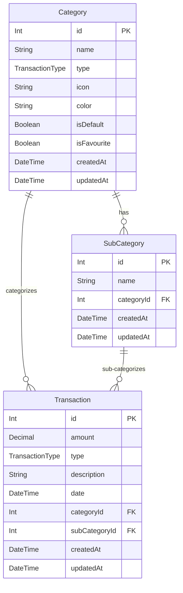

# ARCHITECTURE.md

## Project: Finance Tracker (Record-income-and-expenses)

---

## System Overview

Personal finance tracking app for recording income, expenses, and investments in Thai Baht (THB). Single-user, no authentication required. React SPA communicates with a NestJS REST API backed by PostgreSQL. Supports bilingual UI (Thai / English) and dark / light theme.

---

## Component Diagram

```
┌─────────────────────────────────────────────────────────┐
│                        Browser                          │
│   React 19 + Vite + TypeScript                          │
│   MUI v7 + Tailwind CSS v4  |  react-i18next (th/en)   │
│   react-router-dom v6       |  Zustand v5 (state)       │
│   react-hook-form v7 + zod v4 (forms)                   │
└──────────────────────┬──────────────────────────────────┘
                       │ HTTP REST (axios v1)
                       ▼
┌─────────────────────────────────────────────────────────┐
│                   NestJS 11 Backend                     │
│   REST API (/api/*)   |  Prisma v5 ORM                  │
│   class-validator     |  Swagger / OpenAPI              │
│   HttpExceptionFilter |  ValidationPipe (global)        │
└──────────────────────┬──────────────────────────────────┘
                       │ Prisma Client
                       ▼
┌─────────────────────────────────────────────────────────┐
│                   PostgreSQL 16                         │
│   Managed via Docker Compose                            │
└─────────────────────────────────────────────────────────┘
```

---

## API Structure

All endpoints are prefixed with `/api/`. No versioning segment.

| Prefix | Module | Description |
|--------|--------|-------------|
| `/api/transactions` | TransactionsModule | CRUD + summary endpoint |
| `/api/categories` | CategoriesModule | CRUD, guarded delete, favourites |
| `/api/sub-categories` | SubCategoriesModule | CRUD, guarded delete |
| `/api/reports` | ReportsModule | monthly, yearly, by-category |

Swagger UI available at: `http://localhost:4000/api/docs`

### Endpoint Reference

**Transactions**
| Method | Path | Description |
|--------|------|-------------|
| GET | `/api/transactions` | List with filters: `?type=&categoryId=&subCategoryId=&startDate=&endDate=&page=&limit=` |
| GET | `/api/transactions/summary` | Balance summary `?startDate=&endDate=` |
| GET | `/api/transactions/:id` | Get single |
| POST | `/api/transactions` | Create |
| PATCH | `/api/transactions/:id` | Update |
| DELETE | `/api/transactions/:id` | Delete |

**Categories**
| Method | Path | Description |
|--------|------|-------------|
| GET | `/api/categories` | List all, optional `?type=INCOME\|EXPENSE\|INVESTMENT` |
| GET | `/api/categories/:id` | Get single |
| POST | `/api/categories` | Create |
| PATCH | `/api/categories/:id` | Update (supports `isFavourite` toggle) |
| DELETE | `/api/categories/:id` | Delete (fails if transactions exist) |

**Sub-Categories**
| Method | Path | Description |
|--------|------|-------------|
| GET | `/api/sub-categories` | List all, optional `?categoryId=` |
| GET | `/api/sub-categories/:id` | Get single |
| POST | `/api/sub-categories` | Create |
| PATCH | `/api/sub-categories/:id` | Update |
| DELETE | `/api/sub-categories/:id` | Delete (fails if transactions exist) |

**Reports**
| Method | Path | Description |
|--------|------|-------------|
| GET | `/api/reports/monthly` | `?year=2026&month=6` |
| GET | `/api/reports/yearly` | `?year=2026` |
| GET | `/api/reports/by-category` | `?type=EXPENSE&startDate=&endDate=` |

### Response Format

Success:
```json
{
  "data": { ... },
  "total": 100,
  "page": 1,
  "limit": 20,
  "totalPages": 5
}
```

Error:
```json
{
  "statusCode": 400,
  "message": "Validation failed",
  "error": "Bad Request"
}
```

---

## ER Diagram



---

## Database Tables

### `Category`
| Column | Type | Constraints |
|--------|------|-------------|
| `id` | Int | PK, auto-increment |
| `name` | String | unique, max 100 |
| `type` | TransactionType | enum: INCOME, EXPENSE, INVESTMENT |
| `icon` | String? | optional emoji/icon key |
| `color` | String? | optional hex color |
| `isDefault` | Boolean | default false |
| `isFavourite` | Boolean | default false |
| `createdAt` | DateTime | auto |
| `updatedAt` | DateTime | auto |

Sorted by: `isFavourite DESC, type ASC, name ASC`

---

### `SubCategory`
| Column | Type | Constraints |
|--------|------|-------------|
| `id` | Int | PK, auto-increment |
| `name` | String | unique within categoryId |
| `categoryId` | Int | FK → Category.id |
| `createdAt` | DateTime | auto |
| `updatedAt` | DateTime | auto |

Unique constraint: `(name, categoryId)`

---

### `Transaction`
| Column | Type | Constraints |
|--------|------|-------------|
| `id` | Int | PK, auto-increment |
| `amount` | Decimal(15,2) | positive |
| `type` | TransactionType | enum: INCOME, EXPENSE, INVESTMENT |
| `description` | String? | optional, max 500 |
| `date` | DateTime | indexed |
| `categoryId` | Int | FK → Category.id, indexed |
| `subCategoryId` | Int? | FK → SubCategory.id, optional, indexed |
| `createdAt` | DateTime | auto |
| `updatedAt` | DateTime | auto |

Indexes: `date`, `type`, `categoryId`, `subCategoryId`

---

### `TransactionType` enum
```
INCOME
EXPENSE
INVESTMENT
```

---

## Environment Variables

| Variable | Service | Description |
|----------|---------|-------------|
| `DATABASE_URL` | Backend | PostgreSQL connection string |
| `PORT` | Backend | API listen port (default `4000`) |
| `FRONTEND_URL` | Backend | CORS allowed origin |
| `POSTGRES_USER` | Docker | DB username |
| `POSTGRES_PASSWORD` | Docker | DB password |
| `POSTGRES_DB` | Docker | Database name |
| `VITE_API_URL` | Frontend | API base URL (default `http://localhost:4000`) |

---

## Security Considerations

- No authentication — single-user personal app running locally or behind a private network
- Input validation: `class-validator` + `ValidationPipe` (global, whitelist: true) on all DTOs
- SQL injection: prevented by Prisma parameterized queries
- CORS: configured in NestJS to allow only the frontend origin (`FRONTEND_URL`)
- Decimal precision: amounts stored as `Decimal(15,2)` to avoid floating-point rounding

---

## Docker Services

| Service | Port | Description |
|---------|------|-------------|
| `postgres` | 5432 | PostgreSQL 16 database |
| `backend` | 4000 | NestJS API server |
| `frontend` | 3000 | React + Vite dev server (hot reload) |

Two compose files:
- `docker-compose.dev.yml` — development with hot reload
- `docker-compose.yml` — production build
